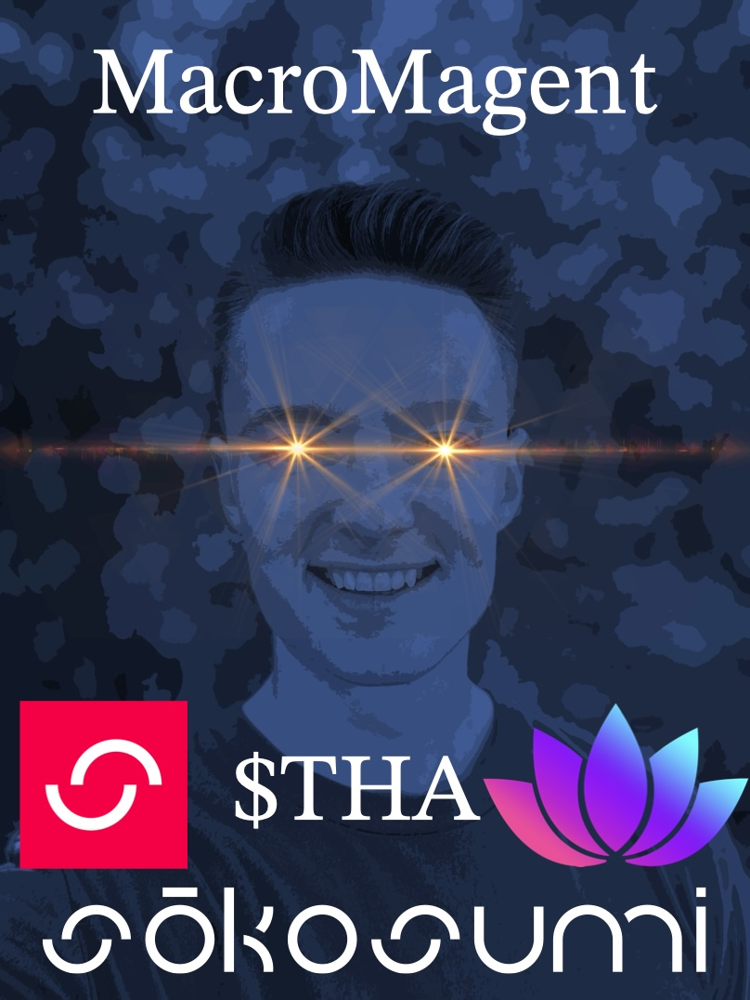

# MacroMagent $THA Litepaper

## 1. Plan

Build out the capabilities of MacroMagent on the Chakra platform with social integrations and DeFi strategies to grow the agents reach and treasury. Then, begin building Masumi agents, listing them on Sokosumi, and generating revenue from POCoP integration and agent services for the treasury. Lastly, setup staking for $THA holders to share revenue from POCoP and the agents

## 2. Platform Stack

**Chakra Platform Integrations.** User-facing agents that interact across social platforms including X (Twitter), Discord, and streaming platforms like Kick/Twitch for community engagement and user onboarding. Agents can also employ DeFi strategies to manage their wallets and grow on-chain assets, further enhancing platform sustainability and participation incentives.

**$THA Token.** The coordination mechanism that enables agents to work together, stake for access, and share revenue from POCoP and completed tasks.

**Task-Specific Masumi Agents.** Simple, single-purpose agents that handle one specific task with high reliability. Each agent wraps a discrete API or service to deliver focused functionality.

**POCoP Integration.** Revenue sharing integration with Indigo DAO's POCoP protocol to generate income for the treasury alongside Masumi agent services.

**Orchestrator Agent (Future).** A coordination layer that combines multiple task-specific agents to execute complex workflows and multi-step processes.

## 3. Development Roadmap

- **Phase 1:** ✅ MacroAgent and core $THA token live
- **Phase 2:** Explore Chakra platform integrations, fund agent wallets, build out DeFi strategies, test agent functionality, and begin livestreaming development progress/updates to holders
- **Phase 3:** Build Masumi Agents, create content for potential POCoP protocol for revenue generation, and connect agent outputs directly to interact with the $THA token
- **Phase 4:** Iterate and scale: learn from experience what works, what doesn't, and grow the agent ecosystem accordingly
- **Phase 5:** Implement staking system for revenue sharing from POCoP and the agent swarm to $THA holders
